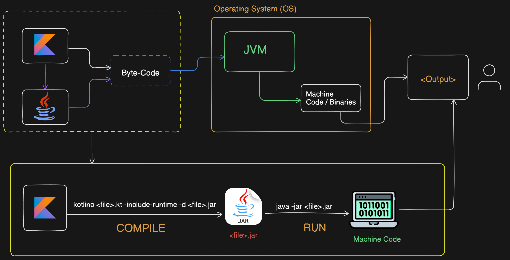

# Module 2: Basics of Kotlin

## Kotlin Code Execution Architecture
<br>



### Variables and Data Types:
- Kotlin variables refer to memory location to store data
- It is container which holds values
- data of the variables can be changes and reused in program

  ```kotlin

  var userName = "Nil369"
  val action = "Follow"

  ```

#### val vs. var:

  - **var** type variabels are mutable can be changed

  ```kotlin
    var name="Explore Coding with Akash"
    name="Follow "//Success
  ```

   - **val** types of variables are immutable cannot be changed

  ```kotlin
   val name="Explore Coding with Akash"
   name="Follow "//Error
  ```

#### Data Types:

  - Data types represent the type of data variables holds.

    - Number

      Hold any type of numeric values. Numbers can be of two types

        - Integers(Byte-1bytes, Short-2Bytes, Int-4Bytes ,Long-8Bytes)
        - Floating Point(Float-4Bytes, Double-8Bytes)

    - Character

      In kotlin char represented by **Char** keywords
      2Bytes

    - Boolean

      true/false - 1bit

    - Array

      Represented by Kotlin **Array** class and can be created using function **_arrayOf()_** and **Array()** constructor.

    - String

      In Kotlin String is represented by **String** class.

      Set of character is a string.

      "This is simple string"

      """
      This is raw string
      """

#### Type inference:
  When be created and assign variables instantly the there is not need to provide the type is inferred by compiler.

  ```kotlin
    val name = "Akash Halder"
  ```

#### Type Conversion:

  There are helper functions that helps us to convert one type value into another type

  ```kotlin
  toByte()
  toShort()
  toInt()
  toLong()
  toFloat()
  toDouble()
  toChar()
  ```

  Example

  ```kotlin
  var value1=50
  var value2:Long=value1.toLong()

  ```

#### Basic Operators:
- Arithmetic operators

  > +, -, \*, /, %

- Comparison operators

  > < >  , <, >=, <=, !=, ==

- Logical operators

  > &&, ||, !
  

#### Input/Output:

- **readln()** and **readLine()** functions is used to take input

- **print()** and **println()** functions are used to print on console